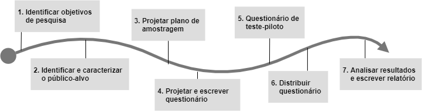

# Pacote de Pesquisa - Survey de Jogos Educacionais em Interação Humano-Computador 

## Introdução

Com o intuito de auxiliar o processo de desenvolvimento de jogos sérios digitais que apoiem o ensino e aprendizagem na área de Ciência da Computação, este survey serviu como ferramenta para alcançar o objetivo do trabalho "Aspectos de Qualidade em Jogos Sérios Digitais". O objetivo deste trabalho foi analisar  os aspectos  de  qualidade  em jogos sérios  digitais que auxiliaram  no  processo  de ensino e aprendizagem  de  estudantes de graduação e pós-graduação na ́area  de  Ciência  da  Computação.  Os  aspectos  de qualidades,  considerados  nesse  trabalho,  foram  os  requisitos  de  qualidade  do  jogo e a experiência do usuário (jogador).

A Figura abaixo apresenta as etapas para realização de um survey segundo Kasunic (2005):

O processo de um survey  inicia-se  com  a  identificação  do(s)  objetivo(s)  de  pesquisa. Em seguida é necessário identificar o público-alvo, pontuando  suas  características  relevantes  para  o estudo. Depois é feito  um  plano  de amostragem, definindo o local de coleta dos dados, o período, a forma de coleta e o instrumento. A partir disto ́e elaborado o questionário (o instrumento de pesquisa), sendo primeiramente feitas uma ou mais rodadas de teste, ajustes e melhorias para então o questionário em sua versão final ser distribuído. Ao final do período de coleta os dados são analisados e por fim é escrito o relatório dos resultados (Kasunic, 2005).

##  1. Identificar os objetivos de pesquisa

Na primeira etapa é definido o objetivo do survey. Para isto Kasunic (2005) aponta que se deve ter uma compreensão do problema e dos estudos já desenvolvidos. Para isso Mark Kasunic sugere que sejam feitas perguntas internas pela equipe de pesquisa para se construir o objetivo e assim tê-lo com clareza, além de realizar uma revisão da literatura sobre o assunto em questão. Definir o objetivo irá ditar o que será realizado na pesquisa (Kasunic, 2005).

Tendo em vista o foco geral do trabalho e o seu objeto de pesquisa, é definido como objetivo deste survey "identificar quais os aspectos de qualidade em jogos sérios digitais no processo de ensino e aprendizagem são apreciados pelos seus jogadores". O objetivo foi definido basenado-se nas questões: "Quais aspectos de qualidade devem ser analisados?", "Qual o tipo de interação dos respondentes com jogos educacionais digitais?" "Qual o interesse e motivação dos respondentes no uso de jogos digitais educacionais?"

Com o levantamento destas questões foi realizada uma revisão na literatura, na qual foram utilizadas como base para a construção do questionário o trabalho sobre fatores de qualidade do modelo MEEGA+ (Petri  e  Wangenheim, 2019), assim como a revisão sistemática da literatura sobre os requisitos funcionais e características de experiência de usuário em jogos sérios em IHC, identificados por Sales e Silva (2020). 

##  2. Identificar e caracterizar o público-alvo

Nesta etapa primeiramente é identificada a população e depois o público-alvo é caracterizado. Segundo Kasunic (2005) população é definida como todos os membros de um grupo específico, ou seja, ela pode estar relacionada em termos de demografia, geografia, ocupação, tempo ou alguma combinação desses fatores. A população definida é tida como o público-alvo da pesquisa

Para caracterizar o público-alvo algumas questões podem ser levantadas, mas isso vai depender do objetivo do survey. Alguns exemplos são (Kasunic, 2005): 
- Quantas pessoas existem na população?;
- Qual o nível de conhecimento dos respondentes?;
- Qual o nível de experiência dos respondentes sobre o assunto?;
- Quais os meios disponíveis para coletar as respostas dos respondentes?;

Estas perguntas irão auxiliar na escolha do método de pesquisa a linguagem a ser usada na construção dos itens do questionário. Este público-alvo será representado por uma amostra, a qual é definida pelo plano de amostragem, apresentado na etapa seguinte (Kasunic, 2005).

Neste Survey, o público-alvo definido foram alunos de graduação e pós-graduação de cursos da área de  Ciência da Computação. Este grupo de pessoas foi escolhido por conta da sua visão mais técnica quanto às características de qualidade de software, uma possível familiaridade no uso de ferramentas digitais, além de serem os possíveis usuários de jogos digitais educacionais.

##  3. Projetar plano de amostragem

Nessa etapa, o pesquisador determina como o questionário será distribuído para a população de potenciais respondentes. Será feito um plano de amostragem levando em conta como os indivídos serão selecionados e o tamanho da amostra. Isto está atrelado ao grau de generalização que se deseja que os resultados tenham.

A amostragem desta pesquisa é não probabilística, pois não é objetivo deste trabalho generalizar os resultados para fora do público-alvo. Como pretende-se os resultados para elaboração de ferramentas de design para jogos de aprendizagem para cursos de computação não se faz necessário a generalização para outras áreas por exemplo. 

Quanto ao tamanho da amostra, foi planejado para este estudo, um período de quatro semanas para a coleta dos dados, ou seja, a amostra de pesquisa foram os registros de respostas daqueles que participaram dentre os dias 06/10/2020 e 27/10/2020.

##  4. Projetar e escrever questionário

Nesta etapa são executadas a seguintes atividades:

4.1 Determinar as perguntas a serem feitas

4.2 Selecione o tipo / formato de pergunta para cada pergunta e especifique o texto

4.3 Projetar a sequência de perguntas e o layout geral do questionário

4.4 Desenvolver documentos auxiliares

Na primeira atividade são elaboradas questões exeternas. Estas são baseadas nas questões internas levantadas como diretrizes para se alcançar o objetivo da pesquisa (definido na etapa 1). Estas questões externas serão as questões destinadas ao público-alvo e que podem envolver dados do tipo de atributos demográficos, atitudes do respondente, crenças e comportamentos. As perguntas são então priorizadas e modeladas na atividade seguinte.

Na segunta atividade as questões são formatadas a fim de torná-las compreensíveis para o público-alvo e quantitativas para a análise do avaliador. É nesta fase que ocorre a transição da pergunta interna, que geralmente é aberta, para uma pergunta fechada, mista ou aberta, mas com uma linguagem mais simples. 

Na terceira atividade 

Partindo dos insumos obtidos nas etapas anteriores foi elaborado, nesta etapa, o questionário. Os fatores de qualidade do modelo MEEGA+ (Petri  e  Wangenheim, 2019), assim como os requisitos funcionais e características de experiência de usuário identificados por Sales e Silva (2020) foram base para sua elaboração. 

##  5. Questionário de teste piloto

Antes da distribuição do questionário foi realizado um teste piloto com três pessoas. O objetivo do teste foi coletar feedbacks sobre a compreensão e o layout das perguntas, a estrutura e o fluxo do questionário e também identificar erros e o tempo médio para se concluir o questionário. O teste piloto foi realizado de forma virtual, via plataforma de vídeo-chamada. Primeiramente o respondente recebeu algumas informações introdutórias sobre a pesquisa, em seguida ele acessou o questionário em seu computador e ativou o compartilhamento de tela. Dada a confirmação para o início da execução do questionário foram anotadas as percepções do avaliador enquanto o participante respondia.

Concluído o teste piloto foi solicitado um relato oral do responte sobre sua percepção ao longo da execução do questionário, as quais foram anotadas pelo avaliador. Este processo foi realizado com cada um dos três participantes do teste piloto. Depois de analisadas as anotações, foram aplicadas as sugestões de melhoria e corrigidos os erros encontrados no questionário.

##  6. Distribuir questionário

Tendo o questionário já na sua versão final (Apêndice A), este foi distribuído via alguns meios de comunicação virtuais, como mensagem de e-mail e redes sociais para a comunidade discente das instituições de ensino da Universidade de Brasília (UnB), Universidade Federal do Mato Grosso do Sul (UFMS), Universidade Federal do Amazonas (UFAM), Universidade Federal do Mato Grosso (UFMT) e Universidade Católica de Salvador (UCSAL).

##  7. Analisar resultados e escrever relatório

## Referência

- Kasunic, M.Designing an effective survey. [S.l.], 2005
- Petri,  G.;  Wangenheim,  C.  G.  A  method  for  the  evaluation  of  the  quality  of  gamesfor  computing  education.  In: Anais  dos  Workshops  do  VIII  Congresso  Brasileiro de  Informática  na  Educação  (CBIE  2019).  Brazilian  Computer  Society  (Sociedade Brasileira de Computação - SBC), 2019. p. 951. Disponível em: [https://br-ie.org/pub/index.php/wcbie/article/view/9045](https://br-ie.org/pub/index.php/wcbie/article/view/9045).
- Sales, A. B. de;  Silva, M. A. S. e. Jogos sérios no processo de ensino e aprendizagem de interação humano-computador. In:Anais do XXXI Simpósio Brasileiro de Informática na  Educação.  Porto  Alegre,  RS,  Brasil:   SBC,  2020.  p.  552–561.  ISSN  0000-0000. Disponível em: [https://sol.sbc.org.br/index.php/sbie/article/view/12811](https://sol.sbc.org.br/index.php/sbie/article/view/12811).
